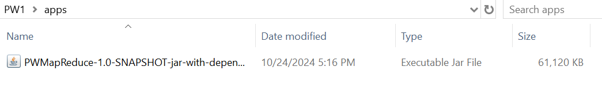
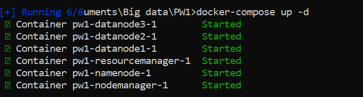
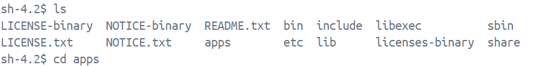
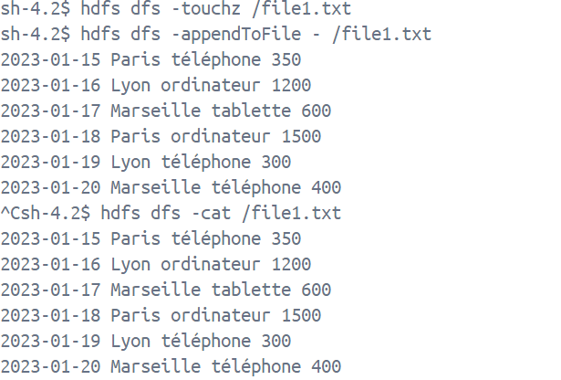
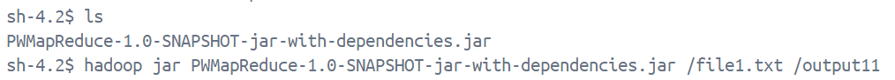
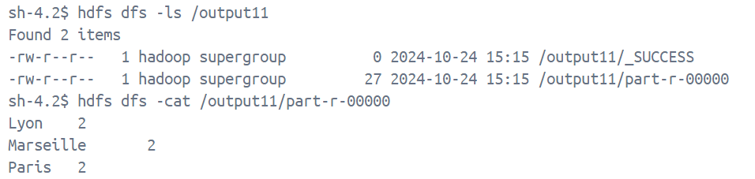
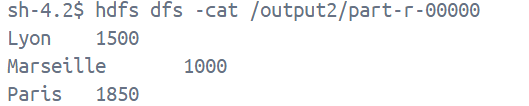
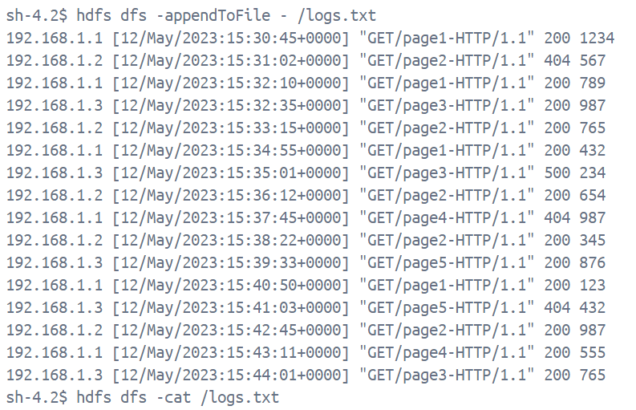
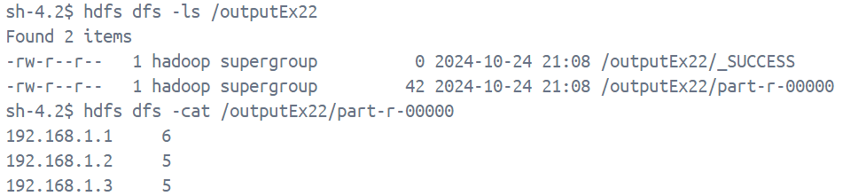
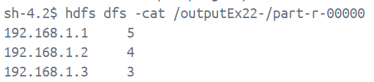

# Projet Hadoop MapReduce 

## Description
Ce projet met en œuvre un job **Hadoop MapReduce** pour analyser des fichiers de logs de serveur web. Il permet d'extraire et d'agréger des informations comme le nombre total de requêtes par adresse IP et le nombre de requêtes réussies (statut HTTP 200).

## Fonctionnalités
- **Mapper** : Extrait l'adresse IP et le statut de la requête (code HTTP) à partir de chaque ligne de log.
- **Reducer** : Regroupe et agrège les données pour chaque adresse IP afin de compter le nombre de requêtes et les succès (statut 200).
#### Phase 1 : Le Mapper
La phase **Map** prend en entrée des paires clé/valeur, où chaque ligne du fichier est une valeur et la clé est la position de la ligne. Le **Mapper** extrait l'adresse IP et le code HTTP à partir de chaque ligne et émet une paire :
- Clé : Adresse IP
- Valeur : 1 pour une requête, et un marquage supplémentaire si le code HTTP est 200 (succès).

#### Phase 2 : Le Reducer
Le **Reducer** agrège les paires générées par les **Mappers** pour compter le nombre total de requêtes et le nombre de requêtes réussies par adresse IP.

## Exécution EX1

#### Nombre total de ventes par Ville.

#### Nombre total de prix de ventes par Ville.

## Exécution EX2

#### Nombre total de requêtes par adresse IP.

#### Nombre total de requêtes réussies (code de réponse 200) par adresse IP.

