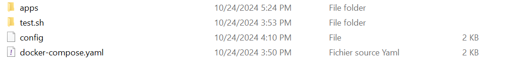

# Projet Hadoop MapReduce - Calcul du Total des Ventes par Ville

## Description
Ce projet implémente un job MapReduce qui analyse un fichier de ventes et calcule le total des ventes par ville. Les données d'entrée sont sous la forme suivante : `date ville produit prix`, et le programme produit en sortie le prix total des ventes pour chaque ville.

## Fonctionnalités
- **Mapper** : Extrait la ville et le prix de chaque ligne de vente.
- **Reducer** : Agrège les prix pour chaque ville et calcule le total des ventes.

## Prérequis
Avant de commencer, assurez-vous que les outils suivants sont installés :
- Hadoop (version 3.3.6 ou supérieure)
- JDK (version 8 ou supérieure)

## Structure du Projet

- `src/` : Contient le code source de l'application.
    - `MapperClass.java` : Classe qui implémente la logique du Mapper.
    - `ReducerClass.java` : Classe qui implémente la logique du Reducer.
    - `MainDriver.java` : Classe qui configure et lance le job MapReduce.

- `data/` : Contient le fichier de données `ventes.txt`.
- `docker/docker-compose.yaml` : Fichier pour configurer les services Docker pour exécuter Hadoop.
## Comment ça marche ?

### Phases Map et Reduce

#### Phase 1 : Le Mapper

La phase **Map** prend en entrée des données brutes sous forme de paires clé/valeur. Chaque ligne du fichier texte est traitée comme une paire, où :

- La clé est le décalage de la ligne dans le fichier (position en octets).
- La valeur est le contenu de la ligne.
  
- Le **Mapper** extrait la ville et le prix, puis émet une paire clé/valeur 

#### Phase 2 : Le Reducer

La phase **Reduce** prend toutes les paires générées par les **Mappers** et regroupe les valeurs ayant la même clé. Pour chaque ville, il calcule la somme des ventes.

## Exécution

